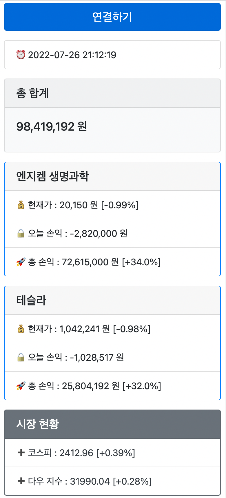

# 실시간 주식 현황 확인
> 웹소켓을 통해 5초 단위 보유 주식 현황 조회

## Used To
- Framework : FastAPI
- External API : 한국 투자 증권 API

## Apps

> ### Stock
> - 보유 주식 및 지수/환율 정보 조회
> - 웹소켓 연동

> ### Viewer
> - 5초 단위로 웹소켓을 이용해 데이터 조회
> - Bootstrap 을 통해 UI 구성
> - 종목 업데이트 기능 추가

# 미리보기

